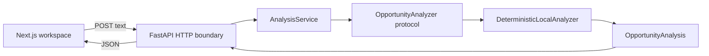

# Architecture

The first slice structures pasted text locally. It has no accounts, database, external model calls or background work.

## Boundaries

- `backend/src/opportunity_intelligence/domain.py`: Pydantic request and response contracts. Input is bounded at 20,000 characters and must contain enough words and letters to form a brief.
- `api.py`: CORS, validation responses, routes and dependency wiring. Invalid requests do not echo input text. The API does not log or persist brief bodies.
- `services.py`: a single application service and structural analyzer protocol. Dependency injection allows replacement in tests and a later provider integration.
- `analyzer.py`: deterministic sentence extraction and keyword rules. The first sentence supplies the title; the first three supply an extractive summary. Requirements and constraints retain source wording. Four topic-presence checks produce missing information and questions. Fixed risk rules flag absent commercial/success terms and sensitive data mentions.
- `frontend/lib/api.ts`: typed HTTP client with a 15-second timeout. The frontend renders results, but performs no analysis. Basic client validation complements authoritative server validation.
- `examples/opportunities.json`: shared synthetic fixtures for the UI and backend tests.

Small Python modules replace nested `api/domain/services` directories for now: each concern fits in one file. Split them only as responsibilities grow.

## Why local rules?

They make the full workflow reproducible, free of credentials and usable offline after dependencies are installed. They establish contracts and test seams without suggesting model intelligence. Keyword presence is not comprehension: negation, nuanced deadlines, conflicts, implicit requirements and completeness are not assessed. Every finding needs human review. The checklist is deliberately limited and English-oriented.

## Future seam

A future analyzer can implement `analyze(text) -> OpportunityAnalysis` and replace the constructor in `get_service`. Provider timeouts, secrets, retries, output validation and evaluations belong in that later change. Long-running or asynchronous providers may warrant an async protocol then; no provider framework is needed now.

## Runtime and trust

Browser state is ephemeral. Refreshing loses the brief and result. No storage APIs or analytics are used. React escapes rendered text. CORS defaults to the two local frontend origins and can be configured with `CORS_ORIGINS` (comma separated). It is not authentication. Bind both servers to loopback for local use. The application is not ready for public hosting.

`NEXT_PUBLIC_API_BASE_URL` is a public browser setting, fixed at frontend build time for production builds. Rebuild after changing it. No secrets belong there. Local startup and analysis need no internet, model keys or remote fonts; dependency installation does need registry access.
